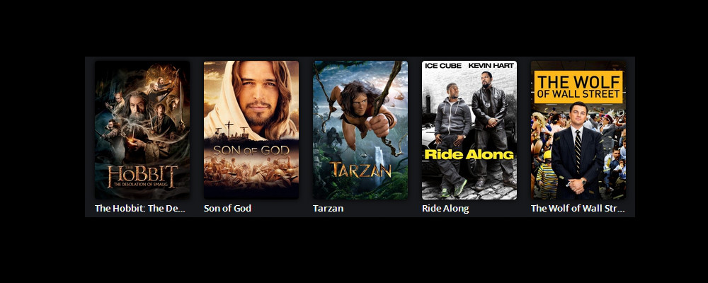

# Movie Browser: Introduction

Visit [QmlBook](https://qmlbook.github.io). Go through chapters 1 to 4 thoroughly.

## Example Mockup

## Elements

* Create a row of movie posters centered in a window. There should be fixed number of 5 posters.
* Poster width should be maximum that can fit in a window and should support window resizing.
* Add space between posters and sides of window.
* Below poster there should be a movie information:
    * Name of the movie
    * Year of release
    * Movie rating when movie is selected
* Selector for the movie can be either scaling (increase current poster size) or border in different color (default border color black, selected border white).
* Navigation should support:
    * Mouse - hovering over a movie changes currently selected movie.
    * Keyboard - pressing left/right on keyboard changes currently selected movie.

It is up to you how you want to structure and save your movie data but it should be as simple as possible.

For all controls, use [Quick Controls 2](http://doc.qt.io/qt-5/qtquickcontrols2-index.html).

Don't use any API calls, everything should be provided inside your application.

All resources (images and QML files) should be saved inside [.qrc resource files](http://doc.qt.io/qt-5/resources.html).
