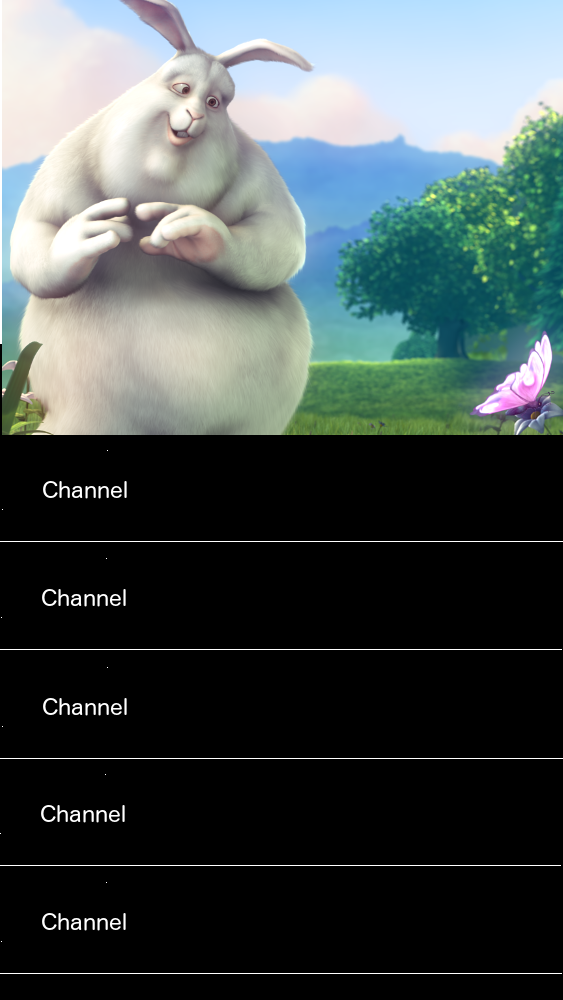

# Simple TV: Content Playout

Visit [QmlBook](https://qmlbook.github.io). Go through chapter 10 thoroughly.

Read http://doc.qt.io/qt-5/androidgs.html thoroughly.

## Example Mockups

## Elements

1. Show channel list and video contained in [channels.xml](channels.xml).
2. By default, first channel is selected.
3. Render selected channel name in red color.
4. Channel can be selected by click or key up/down.
5. On select play channel URL in video.
6. In portrait mode show video on top of the channel list, in landscape show video on the right.
7. Add play/pause icon in the middle of the video that calls `player.stop()` and `player.play()` functions.
8. Add enter/exit fullscreen icon in the bottom right corner that makes video fill screen and return to original container if clicked again.
9. Icon controls, i.e. pause, play, enter/exit fullscreen, should be shown when clicked on video for 5 seconds, after that they should auto hide.
10. For icons use [Ionicons](https://github.com/driftyco/ionicons).
11. Run application on Android emulator.
