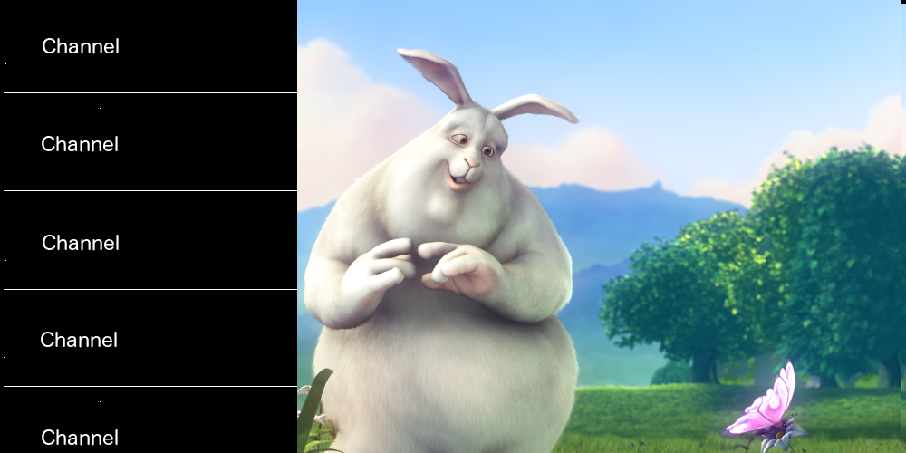

### QML Task4 - Video

Visit [QmlBook](https://qmlbook.github.io).
Go through chapter 10 thoroughly.

Read http://doc.qt.io/qt-5/androidgs.html thoroughly.

example mockup:

* show channel list and video contained in [channels.xml](channels.xml)
* by default first channel is selected
* render selected channel name in red color
* channel can be selected by click or key up/down
* on select play channel url in video
* in portrait mode show video on top of the channel list, in landscape show video on the right
* add pause/play icon in the middle of the video that does player.stop() / player.play()
* add exit/enter fullscreen icon in the bottom right corner that makes video fill screen when full
screen active
* icon controls (pause/play enter/exit fullscreen) should be shown when clicked on video for 5 seconds, after that they should auto hide
* for icons use https://github.com/driftyco/ionicons
* run application on android emulator
