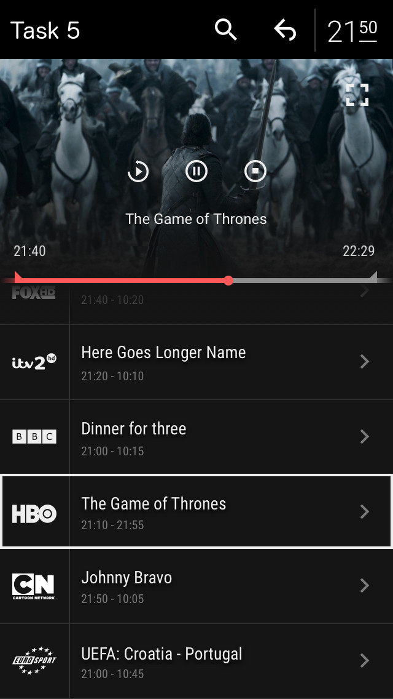
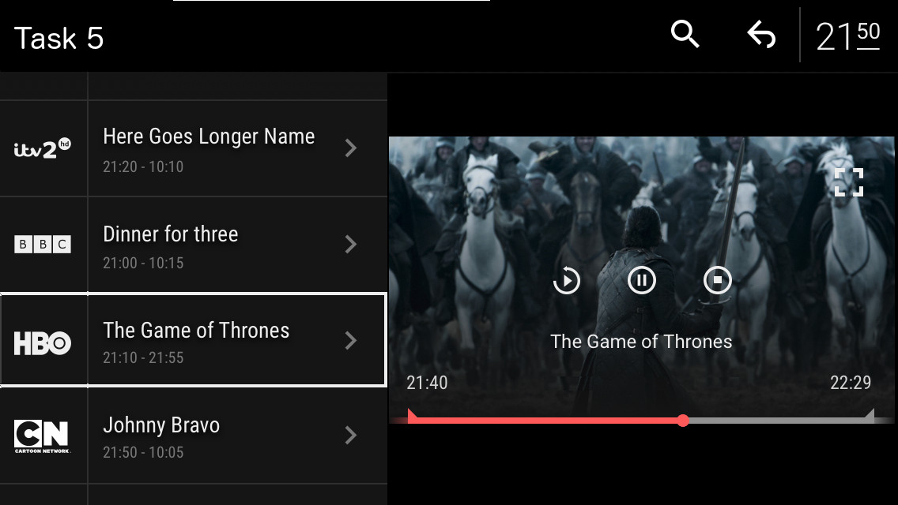

### QML Task5 - Video

Read http://doc.qt.io/qt-5/scalability.html thoroughly.

example mockup:

* show channel list and video contained in [channels.xml](channels.xml)
* by default first channel is selected
* render selected channel name in red color
* channel can be selected by click or key up/down
* on select play channel url in video and update information
* show top bar on top of the screen as specified on mockup
* clock should update every minute
* back should leave application, search should open new empty screen
* in portrait mode show video on top of the channel list, in landscape show video on the right
* add play from start, pause/play (while playing show pause, while paused/stopped show play) and
stop icon (shown if video not stopped) in the middle of the video and make them functional
* add exit/enter fullscreen icon in the top right corner that makes video fill screen when full
screen active
* in fullscreen show video with information at the bottom, no channel list or top bar
* progress bar starts from `start` time and ends with `end` time from [channels.xml](channels.xml)
* current progress value is current time
* icon controls (pause/play/stop enter/exit fullscreen) should be shown when clicked on video for 5 seconds, after that they should auto hide
* for icons use https://github.com/driftyco/ionicons
* run application on android emulator in configurations for mobile and tablet
